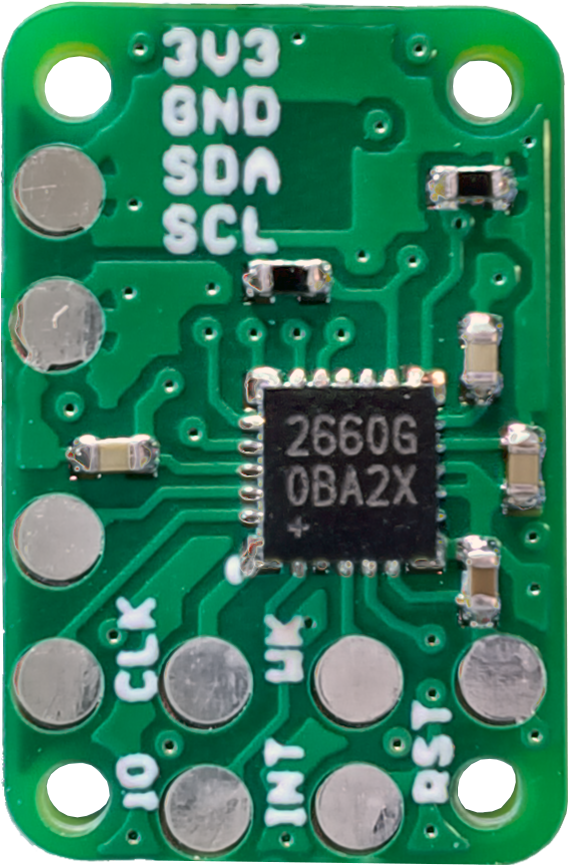
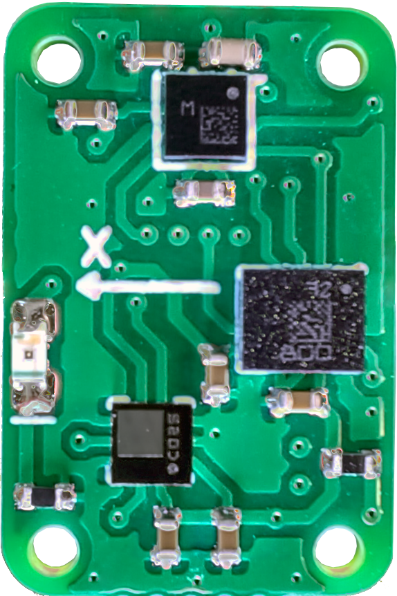

# Board:
Top | Bottom
--- | ---
 | 

# TODOs:
- calibrate
- host interrupt pin function
- wake pin function
- remove all debug serial print lines and uninit debug serial port
- somehow make automated tests? or at least manual tests with some references
- add some documenatation: register map, usage info