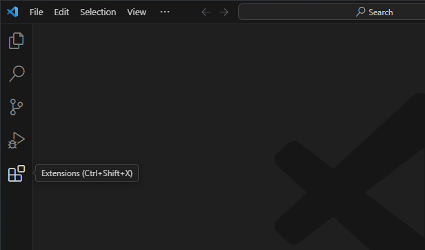
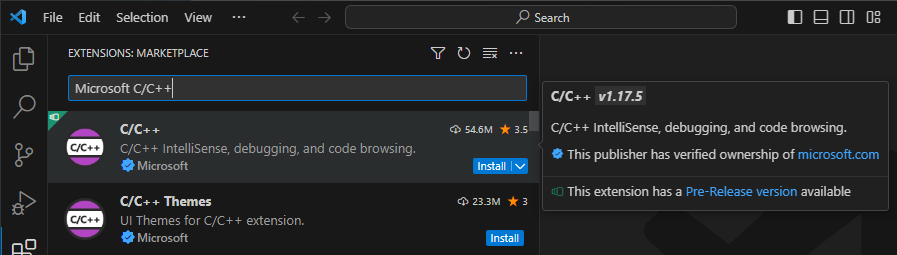
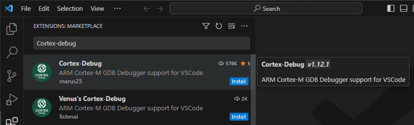
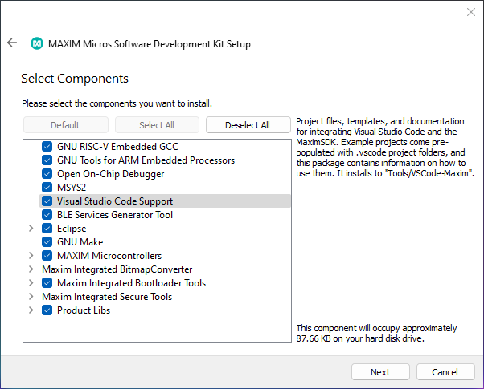
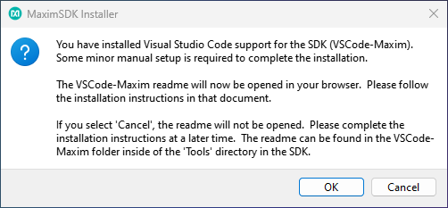
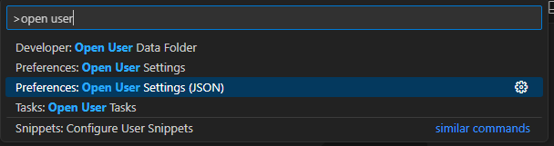
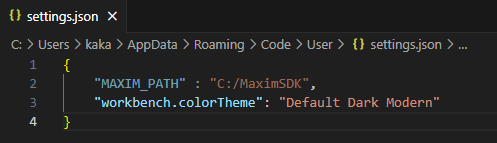
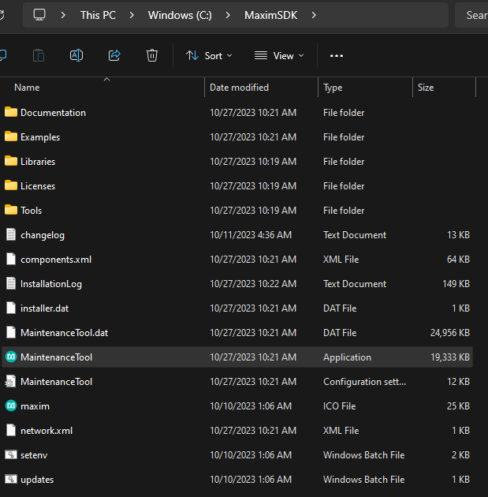

# Development environment setup guide

For a full guide please visit: https://analog-devices-msdk.github.io/msdk/USERGUIDE/#installation
Further down I will focus on how I setup my own dev environment.

## Visual Studio Code
I use Visual Studio Code as my IDE.
You can download and install it from: https://code.visualstudio.com/download
After completing the Visual Studio Code installation you need to start the IDE and navigate to the extensions.
- Install the [Microsoft C/C++ extension](https://marketplace.visualstudio.com/items?itemName=ms-vscode.cpptools)
- Install the [Cortex-Debug extension](https://marketplace.visualstudio.com/items?itemName=marus25.cortex-debug)
- Later on we will come back and tell Visual Studi Code where we installed the Maxim Micros SDK

## Maxim Micros SDK
You can find documentation, resources, tool, etc.. at: https://www.analog.com/en/products/max32660.html

In the Tools and Simulation section you can find the Maxim Micros SDK download link(s).
Here I give the link to the latest version I can find during writing this guide:
[Maxim Micros SDK (Windows), 1.0.1](https://www.analog.com/en/design-center/evaluation-hardware-and-software/software/software-download?swpart=SFW0010820B)

During the Maxim Micros SDK (Windows) installation on the component selection screen make sure that "Visual Studio Code Support" is checked.

When the installation finishes a popup will appear that will take you to the readme file of the Visual Studio Code Support github page: https://github.com/Analog-Devices-MSDK/VSCode-Maxim/blob/main/README.md

## Setting the "MAXIM_PATH" in your VS Code settings
- Open Visual Studio Code
- Press Ctrl + Shift + P
- In the popup type "Preferences: Open User Settings (JSON)"
- Add a new entry called "MAXIM_PATH" with the path of your MaximSDK installation path. Only use forward slash characters.

## How to build
- Open Visual Studio Code
- Open the project
- Press Ctrl + Shift + B
- From the popup select build (or clean and the build).

## How to update the Maxim SDK
You can run the MaintenanceTool.exe which will automatically guide you through the update.

