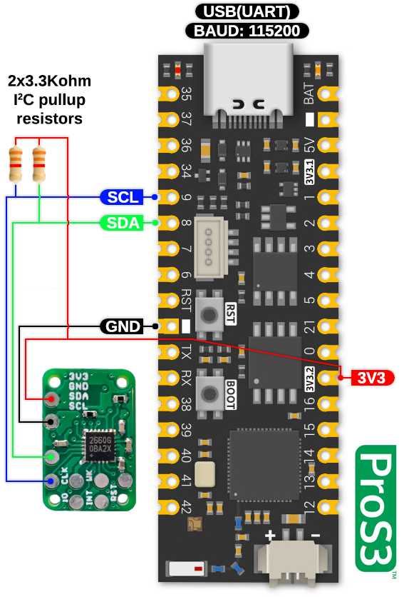
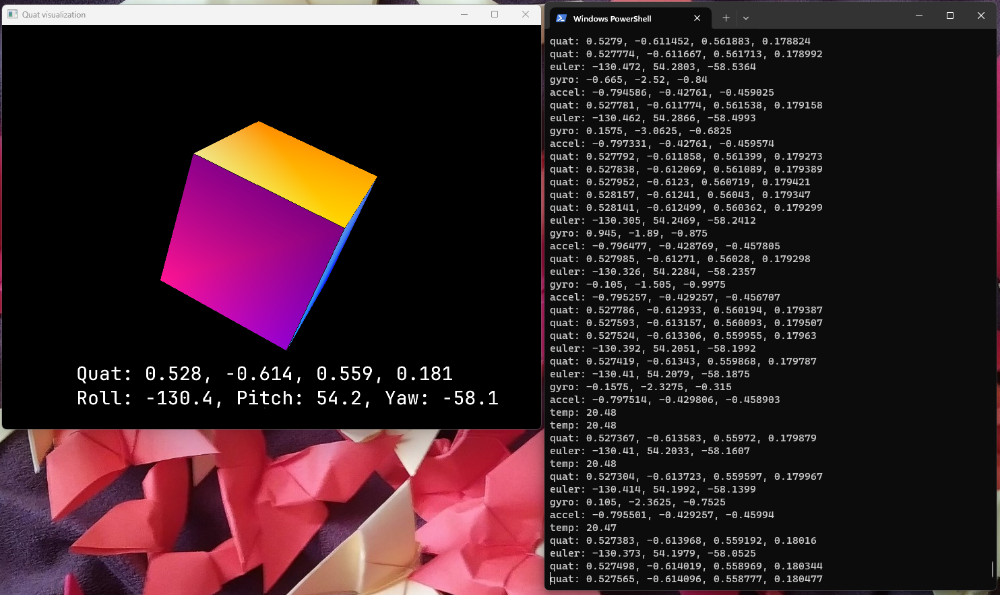

# Read out sensor fusion data from host

## Software Prerequisites
- python3

## Hardware Prerequisites
- board with circuitpython (or you can write your own arduino library to use other boards)

## Wiring
Connect your host board to the sensor fusion board via i2c.
Connect your host board to the windows PC via serial (in my case I use the built in circuitpython REPL).

I used Unexpected Maker's PROS3 board (ESP32-S3):

