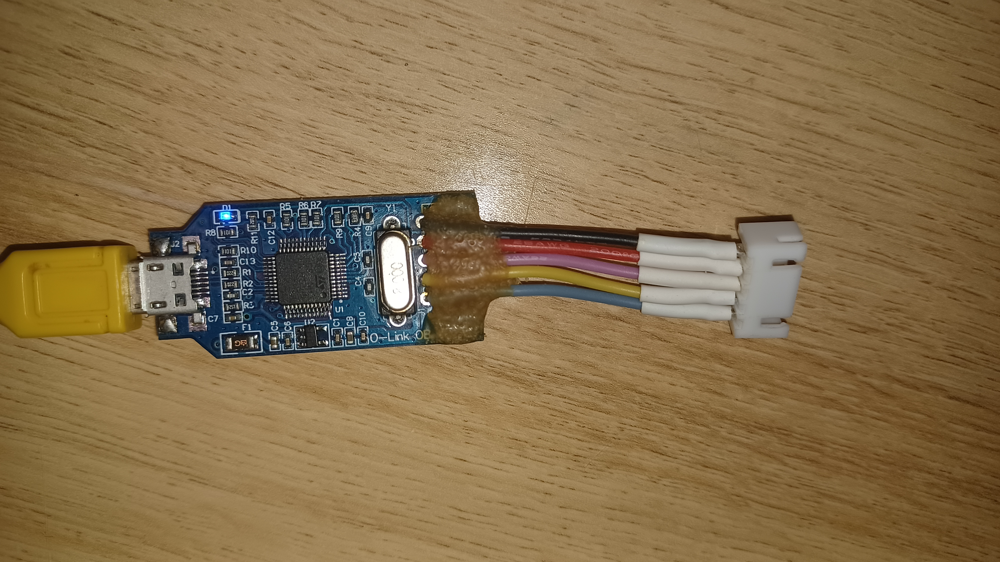
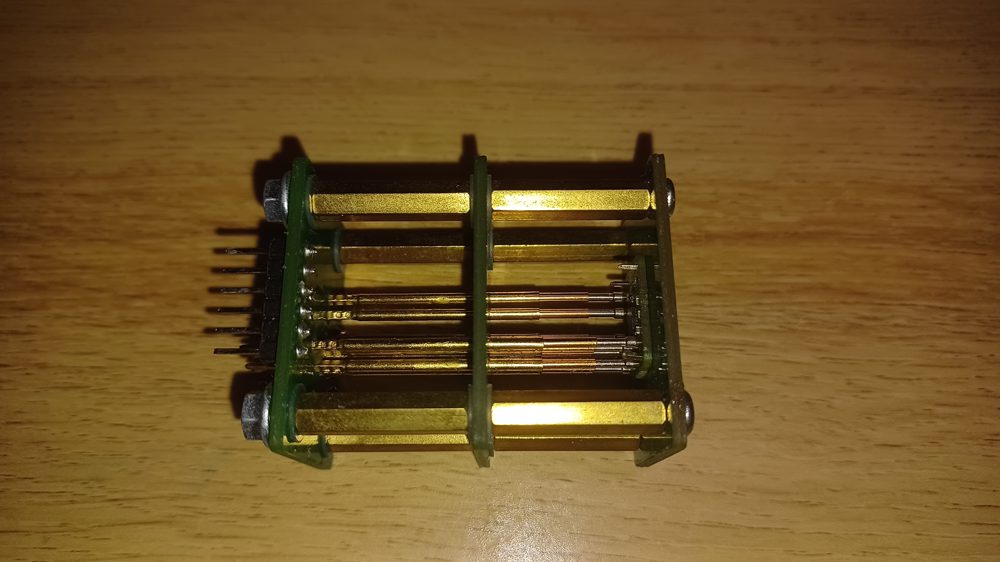

# Upload to board

## Software Prerequisites
- python3
- [SEGGER JLink](https://www.segger.com/downloads/jlink/)

## Hardware Prerequisites
- Programmer (Ebay search words: "J-Link OB ARM Debugger Programmer Downloader V8 SWD")
- MAX32660 sensor board
- Jumper wires
- Optional, Serial to USB converter (3.3V) to print out debugging messages






## Programmer Wiring
Board      | Programmer
-----------|-----------
GND        | GND
3.3V       | 3.3V
SWDCLK/AD0 | SWCLK
SWDIO/BT   | SWDIO
RST        | RST


## Serial Wiring (optional)
Board | Serial to USB
------|--------------
GND   | GND
INT   | RX


## Upload
- Wire up the programmer to the board
- Open command line and run command:
```
python path/to/jlink_upload.py
```

## What the script does
- Opens and SWD connection
- Executes commands from file command_file.jlink
	* Uploads the built elf file to the board
	* Resets the board
	* Starts the board
	* Closes the SWD connection